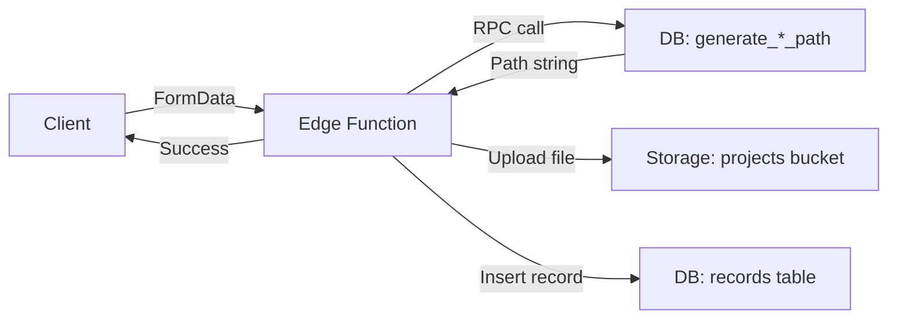

# Storage Structure Quick Reference

## Path Patterns

| Entity Type | Path Pattern |
|------------|--------------|
| **Option Model** | `{project}/options/{option_id}/model_{ts}.glb` |
| **Recording GLB** | `{project}/records/records_glb/{option_id}/{scenario_id}/processed_recording_{ts}.glb` |
| **Recording Raw** | `{project}/records/records_csv/{option_id}/{scenario_id}/raw_recording_{ts}.json` |
| **Project Context** | `{project}/others/context_{ts}.glb` |
| **Project Heatmap** | `{project}/others/heatmap_{ts}.glb` |

*Where `{project}` = `{sanitized_name}_{project_id}`*

## Database Functions

```sql
-- Get project folder name (new function)
SELECT get_project_folder_name('project-uuid-here');
-- Returns: "my_project_abc-123-def"

-- Generate option model path
SELECT generate_option_model_path('project-id', 'option-id', 1234567890);
-- Returns: "my_project_abc-123/options/option-id/model_1234567890.glb"

-- Generate record GLB path
SELECT generate_record_glb_path('project-id', 'option-id', 'scenario-id', 1234567890);
-- Returns: "my_project_abc-123/records/records_glb/option-id/scenario-id/processed_recording_1234567890.glb"

-- Generate record raw path
SELECT generate_record_raw_path('project-id', 'option-id', 'scenario-id', 1234567890, 'json');
-- Returns: "my_project_abc-123/records/records_csv/option-id/scenario-id/raw_recording_1234567890.json"

-- Generate project other path
SELECT generate_project_other_path('project-id', 'context', 1234567890);
-- Returns: "my_project_abc-123/others/context_1234567890.glb"
```

## Edge Function Usage

```typescript
// In save-recording-with-glb/index.ts or save-recording/index.ts

// 1. Get project folder name
const { data: projectPath } = await supabaseClient
  .rpc('get_project_folder_name', { project_id: projectId })

// 2. Generate file path
const timestamp = Date.now()
const { data: glbPath } = await supabaseClient
  .rpc('generate_record_glb_path', {
    p_project_id: projectId,
    p_option_id: optionId,
    p_scenario_id: scenarioId,
    p_timestamp: timestamp
  })

// 3. Upload to storage
await supabaseClient.storage
  .from('projects')
  .upload(glbPath, fileData, {
    contentType: 'model/gltf-binary',
    upsert: false
  })
```

## Client TypeScript Usage

```typescript
import {
  generateStoragePath,
  generateOptionModelPath,
  generateRecordGlbPath,
  generateRecordRawPath,
  parseStoragePath
} from './supabase/storage-utils'

// Example context
const context = {
  projectId: 'abc-123',
  projectName: 'My Project',
  optionId: 'option-456',
  scenarioId: 'scenario-789'
}

// Generate paths (for preview/validation)
const { bucket, path } = generateStoragePath('record', 'processed_recording', context)

// Or use specific functions
const modelPath = generateOptionModelPath(context)
const recordPath = generateRecordGlbPath(context)
const rawPath = generateRecordRawPath(context, 'json')

// Parse existing path
const parsed = parseStoragePath(path)
console.log(parsed.projectName, parsed.optionId, parsed.timestamp)
```

## Upload Flow



## Storage Policies

| Action | Who | Bucket | Allowed? |
|--------|-----|--------|----------|
| SELECT | public/anon | projects | ✅ Yes |
| SELECT | authenticated | projects | ✅ Yes |
| INSERT | service_role | projects | ✅ Yes |
| INSERT | anon/authenticated | projects | ❌ No |
| UPDATE | service_role | projects | ✅ Yes |
| DELETE | service_role | projects | ✅ Yes |

**Key Point**: Only Edge Functions (service_role) can upload files. Clients must use Edge Functions.

## Common Tasks

### Clean Up Incomplete Uploads (Before Re-upload)
```typescript
// Clean up incomplete/failed upload_files before starting new upload
// Call this if you get "X of Y required files not completed" errors
const { data, error } = await supabase.rpc('cleanup_incomplete_option_uploads', {
  p_option_id: optionId
})

// Returns:
// {
//   success: true,
//   option_id: "...",
//   deleted_incomplete_files: 4,
//   message: "Incomplete uploads cleaned up successfully"
// }

// For records:
const { data, error } = await supabase.rpc('cleanup_incomplete_record_uploads', {
  p_record_id: recordId
})
```

### Reset Completed Upload for Re-upload
```typescript
// Reset option back to draft status (allows re-uploading)
// This deletes ALL upload_files and clears model_url
const { data, error } = await supabase.rpc('reset_option_for_reupload', {
  p_option_id: optionId
})

// Returns:
// {
//   success: true,
//   option_id: "...",
//   previous_status: "completed",
//   new_status: "draft",
//   deleted_files_count: 3,
//   message: "Option reset successfully for re-upload"
// }

// Reset record back to draft status
const { data, error } = await supabase.rpc('reset_record_for_reupload', {
  p_record_id: recordId
})
```

### Upload Option Model
```typescript
// Client sends to Edge Function
const formData = new FormData()
formData.append('projectId', projectId)
formData.append('optionId', optionId)
formData.append('modelFile', file)

await fetch('/functions/v1/upload-option-model', {
  method: 'POST',
  headers: { 'Authorization': `Bearer ${token}` },
  body: formData
})
```

### Upload Recording
```typescript
// Client sends to Edge Function
const formData = new FormData()
formData.append('projectId', projectId)
formData.append('optionId', optionId)
formData.append('scenarioId', scenarioId)
formData.append('glbFile', glbFile)
formData.append('csvFile', csvFile) // optional

await fetch('/functions/v1/save-recording-with-glb', {
  method: 'POST',
  headers: { 'Authorization': `Bearer ${token}` },
  body: formData
})
```

### Download File
```typescript
// Files are public, direct download
const url = `${SUPABASE_URL}/storage/v1/object/public/projects/${path}`
const response = await fetch(url)
const blob = await response.blob()
```

## Migration Notes

- Migrations `20260125161000` and `20260125162000` implement this structure
- Old `models` and `recordings` buckets are deprecated
- All new uploads use `projects` bucket
- Database functions ensure consistent path generation
- Project names are auto-sanitized for filesystem use

## Files

- **Schema**: `supabase/migrations/20260125161000_add_project_name_field.sql`
- **Storage**: `supabase/migrations/20260125162000_consolidate_storage_buckets.sql`
- **Utils**: `supabase/storage-utils.ts`
- **Docs**: `STORAGE_UPDATE.md`, `STORAGE_IMPLEMENTATION.md`
